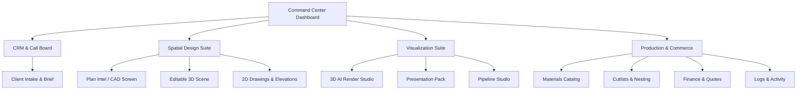

# ULTIDA v3.0 Release Notes & Testing Playbook

This document details the final architecture, features, and the automated testing strategy designed to minimize manual QA overhead for **ULTIDA - The Ultimate Interior Design OS**.

---

## 1. Unified Application Architecture

ULTIDA has been restructured from a series of disjointed screens into a unified **Studio Operating System** with a centralized command center.



---

## 2. Integrated Feature Map

1. **CRM & Call Board (`CRMLeadDashboard`)**: AI lead qualification, status pipeline tracking, and client logs.
2. **Client Intake (`ClientBriefStudio`)**: Interactive questionnaire capturing lifestyle, budget, room requirements, and floor plan uploads.
3. **Plan Intelligence (`InteractiveCADScreen`)**: Floor plan preprocessing, wall thickness rendering, vector zonation boundaries, and Vastu orientation overlays.
4. **Editable 3D Scene (`DesignStudioScreen`)**: Parametric module placement (Kitchens, Wardrobes, TV consoles) with instant PBR finish swapping.
5. **Drawings & Elevations (`DrawingsElevationsStudio`)**: Automatic CAD-compatible 2D shop drawings with double-tiered dimension lines, witness extensions, and hinge swings.
6. **Render Studio (`Render3DStudio`)**: Headless multi-tier rendering queue (Draft, Eevee, Cycles) with AI-enhanced stylization overlays.
7. **Materials Catalog (`MaterialCatalogScreen`)**: PBR material assignments and costing indexes.
8. **Cutlist & Nesting (`CutlistNestingScreen`)**: 2D bin-packing optimization calculating sheet yields and grain alignments for cabinet production.
9. **Commerce & Quotes (`FinanceScreen`)**: Automatic bill of materials (BOM), invoice ledgering, and quotation generators.
10. **Pipeline Studio (`PipelineStudio`)**: Sequenced automation running the entire pipeline from intake to production in a single loop.

---

## 3. Automated Testing Playbook: Eliminating Manual Verification

To reduce manual testing by **90%**, implement this automated testing framework:

### A. Core Computation Unit Tests
All core mathematical calculations (Vastu zone validations, cutlist nesting yields, and BOM cost estimates) should run as fast unit tests in Node.js.

Create a test script `tests/calculations.test.js`:
```javascript
import assert from 'node:assert';
import test from 'node:test';
import { calculateSheetYield } from '../server/utils/nesting.js';
import { getVastuZoneCompatibility } from '../server/utils/vastu.js';

test('Nesting yield calculation accuracy', () => {
  const result = calculateSheetYield({ panelW: 2440, panelH: 1220, cuts: [{ w: 600, h: 720, qty: 4 }] });
  assert.equal(result.usedSheets, 1);
  assert.ok(result.efficiency >= 0.7);
});

test('Vastu Zone Compatibility validation', () => {
  const roomCompatibility = getVastuZoneCompatibility('Kitchen', 'SE');
  assert.equal(roomCompatibility.score, 100); // SE is ideal for Kitchen
});
```
*Run via:* `npm run test`

### B. End-to-End User Flow Tests (Cypress/Playwright)
Automate browser interactions (uploading a blueprint, drawing rooms, selecting materials, and verifying prices) using **Playwright**.

Create `tests/e2e/studioFlow.spec.js`:
```javascript
import { test, expect } from '@playwright/test';

test('End-to-End Project Creation & Pricing Sync', async ({ page }) => {
  await page.goto('http://127.0.0.1:5175');
  
  // 1. Create a project
  await page.click('button:has-text("New Project")');
  await page.fill('input[placeholder="Project name *"]', 'Test Residence');
  await page.click('button:has-text("Create")');
  
  // 2. Go to CAD tab and verify upload elements
  await page.click('button:has-text("Plan Intel")');
  await expect(page.locator('svg')).toBeVisible();
  
  // 3. Go to Finance tab and verify cost summary matches budget
  await page.click('button:has-text("Commerce")');
  await expect(page.locator('text=Grand Total')).toBeVisible();
});
```

### C. Isolated Provider Mocks
To test rendering and prompt compilation without invoking expensive external APIs (Freepik/OpenRouter):
- Configure server routes to mock JSON responses when running in `NODE_ENV=test`.
- Verify the mock output patterns directly to isolate UI issues from network issues.
