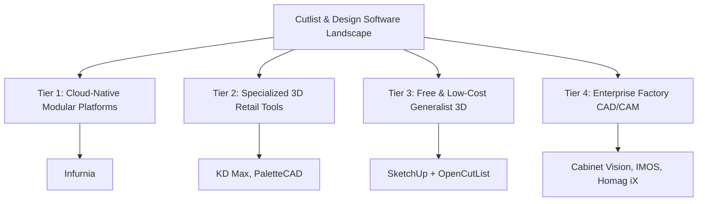

# Comprehensive Analysis of Current Cutlist & Design Software in India

An in-depth analysis of the software tools currently utilized in the Indian modular furniture and interior design ecosystem for generating cutlists. This analysis highlights how they operate, their pricing, and their core limitations for small-to-medium enterprises (SMEs), individual interior designers, and local boutique workshops.

---

## 1. Landscape of Current Software

The Indian modular furniture market is highly fragmented, ranging from premium corporate brands (like Sleek by Asian Paints, Godrej Interio, and Hacker) to thousands of local small-scale modular manufacturers and individual interior designers who work with local carpentries. The software tools used can be categorized into four distinct tiers:

---

## 2. In-Depth Tool Breakdown

### A. Infurnia (Cloud-Native Modular Platform)
Infurnia is a cloud-based design portal that integrates architectural drawings, 3D visualization, and manufacturing output. It has gained substantial traction in India due to its browser-based nature.

*   **How it Works:** 
    1.  **3D Modeling:** The designer builds a kitchen or wardrobe using modular cabinets from a catalog.
    2.  **MES Integration (Manufacturing Execution System):** The 3D model is linked to a work order. 
    3.  **Variable Catalog Rules:** The system defines how panels overlap, material thicknesses (e.g., 18mm Marine Ply), and edge banding defaults (e.g., 2mm front, 0.8mm internal).
    4.  **Automatic Generation:** The cloud engine processes the 3D model and outputs a CSV cutlist, along with nesting board layouts and CNC machine codes (DXF or MPR files for Biesse/Homag).
*   **Pricing (Indian Market):** Credit-based subscription. 1 Infurnia credit = ₹1. Base annual subscriptions for businesses generally start around **₹40,000 to ₹60,000 per user/year**, with extra costs per render, custom catalog setup, or MES usage.
*   **Core Weaknesses for Small Designers:**
    *   **Extremely High Learning Curve:** Configuring custom cabinet catalogs, joinery rules, and manufacturing constraints requires a dedicated CAD administrator.
    *   **Overkill Feature Set:** Small design studios just want a fast cutlist without setting up a full-scale factory MES system.
    *   **Internet Dependency:** Being fully cloud-native, it performs poorly in areas of India with unstable or slower internet connections.
    *   **Subscription Friction:** Recurring costs are highly unpopular with local, independent designers who prefer one-time payments or low usage-based costs.

---

### B. KD Max (Offline 3D Retail Design Tool)
KD Max is a prominent Windows-based CAD tool widely used by modular kitchen dealers and retail showrooms in India for fast drafting and rendering.

*   **How it Works:** 
    *   It uses pre-configured modular cabinet blocks that can be customized in height, width, and depth.
    *   Once a layout is finished, the software generates a basic "Cabinet Report" and bill of materials (BOM), which lists the cabinet codes and outer panel sizes.
    *   To get actual raw cutlists, users must buy an add-on module or export the parts list to an external panel optimizer.
*   **Pricing (Indian Market):** 
    *   **1-Year Subscription License:** Approx. **₹50,000 – ₹65,000 + GST**.
    *   **Perpetual / 5-Year Dongle License:** Approx. **₹90,000 – ₹1,50,000**.
*   **Core Weaknesses for Small Designers:**
    *   **High Upfront Capital Expenditure:** Small studios cannot afford ₹1 Lakh+ per designer for a license.
    *   **Rigid Catalog Customization:** Modifying how cabinets are put together (e.g., swapping a butt-joint to a dado joint, changing edgeband offsets) is tedious and often requires support from the software vendor.
    *   **Basic Cutlist Capabilities:** The standard version only provides cabinet lists. The detailed raw panel dimensions are frequently incorrect unless the user undergoes extensive, paid catalog-configuration training.

---

### C. SketchUp + OpenCutList (The "Boutique Studio" Standard)
SketchUp is the absolute favorite of Indian freelance designers and small studios due to its intuitive push-pull modeling. **OpenCutList** is a free open-source plugin used to calculate parts from the 3D model.

*   **How it Works:**
    1.  The designer must model the cabinet panel by panel (e.g., drawing left side, right side, top rails, bottom, backing).
    2.  Each panel must be grouped and named carefully (e.g., "Carcass_Side_18mm").
    3.  OpenCutList reads the bounding boxes of these groups and compiles a cutlist. It allows inputting grain direction, edge banding thickness subtraction, and nesting the panels onto standard 8x4 ft sheets.
*   **Pricing (Indian Market):** SketchUp Pro subscription is around **₹25,000/year**, and OpenCutList is **Free**.
*   **Core Weaknesses for Small Designers:**
    *   **Modeling-Error Propagation:** The cutlist is only as accurate as the 3D model. If a designer forgets to subtract 18mm for a butt joint, or misaligns a panel by 2mm in the SketchUp viewport, the cutlist will be wrong, leading to expensive material waste at the workshop.
    *   **Massive Time Sink:** Modeling every single carcass panel, backing ply, and shelf manually for a full kitchen takes hours. Standard designers only model the external boxes/doors for rendering, making the 3D model useless for automatic cutlists unless entirely redrawn.
    *   **No Parametric Intelligence:** Changing the width of a cabinet from 600mm to 550mm requires manual scaling and checking that internal shelves don't overlap sides.

---

### D. Cabinet Vision & IMOS (Enterprise Factory CAD/CAM)
These are heavy-duty, German/American production systems used by massive, automated factories (e.g., Sleek, Godrej, Spacewood) that use computerized beam saws and edge-banders.

*   **How it Works:** They establish a complete digital-twin thread. The 3D model feeds directly into CNC machinery, generating drill holes, hinge boring, grooving, and edgebanding codes.
*   **Pricing (Indian Market):** Perpetual licenses start at **₹3,00,000 – ₹8,00,000+**, plus heavy annual maintenance contracts (AMC) and setup fees.
*   **Core Weaknesses for Small Designers:**
    *   **Prohibitively Expensive:** Completely out of reach for 95% of the Indian market.
    *   **Extreme Setup Complexity:** Requires specialized integration engineers to configure CNC post-processors and hardware databases (Hettich, Blum, Ebco).

---

### E. MaxCut & Cutlist Optimizer (Pure Nesting Software)
These are pure mathematical calculation utilities. They do *not* design furniture or calculate how panels join together. They only calculate how to fit a pre-made list of rectangles onto 8x4 ft plywood sheets.

*   **How it Works:** The user manually calculates every single panel size using paper/pencil or Excel, types the list of dimensions into the software, and clicks "Optimize". The tool generates a PDF sheet layout showing where the carpenter should cut.
*   **Pricing:** Free tiers available; professional subscriptions are around **₹1,500 – ₹3,000/month**.
*   **Core Weaknesses for Small Designers:**
    *   **Does Not Solve the Main Pain Point:** It does not calculate the cutlist; it only optimizes the cutting layout. The tedious, high-risk work of calculating carcass offsets, joint allowances, plinth heights, and edge banding subtractions must still be done manually by the designer or supervisor.

---

## 3. Comparative Summary of Existing Solutions

| Feature | Infurnia | KD Max | SketchUp + OpenCutList | Cabinet Vision / IMOS | MaxCut / Cutlist Opt. |
| :--- | :--- | :--- | :--- | :--- | :--- |
| **Primary User** | Mid-to-Large OEMs | Kitchen Dealers | Independent Designers | Mega Factories | Carpenters / Supervisors |
| **Pricing Model** | Sub. (~₹50k/yr) | Perpetual/Sub. (~₹1.2L) | Sub. (~₹25k/yr) | High Enterprise (~₹5L+) | Sub. / Free (~₹20k/yr) |
| **Cutlist Generation** | Automatic from 3D | Semi-automatic | Semi-automatic (manual modeling) | Fully Automatic | Manual Input Only |
| **Indian Accessories** | Good (Hettich/Blum) | Average | Manual modeling | Fully customized | N/A |
| **Ease of Setup** | Hard (Needs Admin) | Medium | Easy (but tedious) | Extremely Hard | Extremely Easy |
| **White-Labeling** | Not possible | Not possible | Not possible | Not possible | Not possible |

---

## 4. The Untapped Market Opportunity: Small Indian Designers

The gap in the market lies between **pure nesting tools** (which require manual math) and **complex 3D CAD/CAM platforms** (which are too expensive and complex). 

Smaller Indian interior design studios (1 to 5 designers) and local modular workshops (working with manual panel saws) need a tool that is:
1.  **Form-Based & Parametric:** No need to build an entire 3D mesh model panel-by-panel. Just select "Base Cabinet - 2 Doors", enter `H: 720, W: 600, D: 560`, and let the software immediately calculate the raw cut sizes.
2.  **Pre-loaded with Indian Construction Standards:** Built-in knowledge of local plywood sizes (8x4 ft), edge banding offsets, backing ply groove offsets, and Ebco/Hettich basket dimensions.
3.  **Affordable & Mobile-Friendly:** A simple mobile/tablet app that a supervisor can use right on the dusty workshop floor.
4.  **White-Label Ready:** Allowing boutique design firms to print professional, clean cutlists stamped with their own branding, logo, and contract terms to hand over to carpenters or fabrication vendors.
