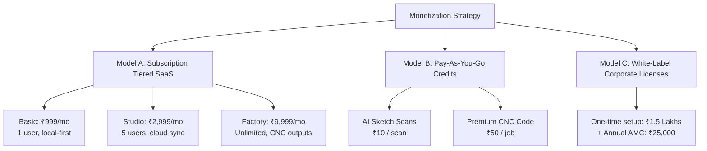

# Technical Blueprint: Monetization, Cloud Sync, & SaaS Architecture

This document outlines the strategic commercialization plan and technical cloud architecture for transforming **Cutlist Pro India** from a local tool into a highly profitable, scalable Software-as-a-Service (SaaS) and enterprise white-labeled product.

---

## 1. Core Monetization Models (Indian Context)

To capture value from small freelance designers, medium modular studios, and large regional fabrication factories, we propose a hybrid monetization model:



### Model A: Tiered SaaS Subscriptions
1.  **Basic Plan (Freelance Designer) - ₹999 / Month:**
    *   Single-user license.
    *   Offline-first, browser LocalStorage only (no cloud sync).
    *   Standard Base, Wall, and Tall cabinet parametric calculations.
    *   Generic PDF exports (watermarked with "Powered by Cutlist Pro").
2.  **Studio Plan (Medium Design Firm) - ₹2,999 / Month:**
    *   Up to 5 designer accounts under one organization.
    *   Fully secure Cloud Database Sync (Supabase PostgreSQL).
    *   **100% White-Labeled PDF Exporter** (Dynamic injection of company logo, GSTIN, custom disclaimers, address, and color skins).
    *   Advanced 2D sheet nesting visualizer with woodgrain orientation overrides.
    *   Shareable project links to send cutlists directly to partner workshops.
3.  **Factory Plan (Modular Manufacturer) - ₹9,999 / Month:**
    *   Unlimited designer and workshop supervisor seats.
    *   Machine-side integration: Generates optimized CNC router G-code and drilling coordinates (DXF/MPR files for Homag, Biesse, Felder panel saws).
    *   Custom catalog creator (define custom joinery math, dado overlap sizes, plinth offsets).

---

### Model B: Transactional Credit Charges (SaaS Extra Services)
To monetize high-compute AI features without increasing the baseline subscription cost, implement a **Virtual Wallet / Credit System** (1 credit = ₹1):
*   **AI Vision Hand-drawn Sketch Scan:** Consumes **10 Credits (₹10)** per scanned page (covering Gemini 3.5 API costs which are near ₹0.20, giving a **98% gross profit margin**).
*   **Exporting CNC Drill Code:** Consumes **50 Credits (₹50)** per carcass assembly file, saving factories hours of machine programming manual work.

---

### Model C: Enterprise White-Labeled Licensing (B2B Sales)
Many established mid-market modular brands in India (dealers of Sleek, Spacewood, Godrej Interio, local OEM networks) want their own proprietary software to tie retail dealers to their factories.
*   **One-Time Deployment Fee:** **₹1,20,000 to ₹1,80,000** to skin the app entirely on their subdomain (e.g. `designer.brandname.in`), customize logo headers, and pre-load their factory-exclusive board catalogs.
*   **Annual Maintenance Contract (AMC):** **₹25,000 / Year** for cloud maintenance, bug patches, and API updates.

---

## 2. Secure Cloud SaaS Architecture

To implement this scale smoothly, the local-first application built in Phase 1 can be wired into a serverless backend using **Supabase** (or Firebase) as the database and auth gateway, and **Razorpay** (dominant in India) or **Stripe** as the subscription manager.

```
+---------------------------------------------------------------------------------+
|                                 REACT CLIENT APP                                |
|        Calculates cutlist locally | Authenticates with Auth Token                |
+----------------------------------------+----------------------------------------+
                                         |
                                         v
+----------------------------------------+----------------------------------------+
|                            SUPABASE GATEWAY (Auth & Sync)                       |
|   1. User Auth: Standard Email/OTP login                                        |
|   2. PostgreSQL Database: Row-Level Security (RLS) protects client projects     |
+-------------------+----------------------------------------+--------------------+
                    |                                        |
                    v                                        v
+-------------------+--------------------+      +------------+--------------------+
|               STRIPE / RAZORPAY        |      |             GEMINI AI API       |
|    Processes subscriptions & wallets   |      |    Parses photos of site plans  |
|    Webhooks auto-update credit tables  |      |    and converts voice inputs    |
+----------------------------------------+      +---------------------------------+
```

---

## 3. PostgreSQL Database Schema Design

This production-ready DDL (Data Definition Language) SQL schema can be deployed directly into a **Supabase PostgreSQL database** to transition Cutlist Pro from local storage to a robust multi-tenant SaaS:

```sql
-- DDL SQL Schema for Cutlist Pro India SaaS

-- 1. Tenant / Organization Table
CREATE TABLE tenants (
    id UUID PRIMARY KEY DEFAULT gen_random_uuid(),
    company_name VARCHAR(255) NOT NULL,
    logo_data_url TEXT, -- Base64 encoded or S3 URL
    primary_color VARCHAR(7) DEFAULT '#0f172a',
    secondary_color VARCHAR(7) DEFAULT '#2563eb',
    accent_color VARCHAR(7) DEFAULT '#fbbf24',
    contact_phone VARCHAR(20),
    contact_email VARCHAR(100),
    office_address TEXT,
    gstin VARCHAR(15),
    disclaimer TEXT,
    subscription_tier VARCHAR(20) DEFAULT 'basic', -- basic, studio, factory
    subscription_status VARCHAR(20) DEFAULT 'active',
    created_at TIMESTAMP WITH TIME ZONE DEFAULT timezone('utc'::text, now()) NOT NULL,
    updated_at TIMESTAMP WITH TIME ZONE DEFAULT timezone('utc'::text, now()) NOT NULL
);

-- 2. User Profiles Table (Linked to Supabase Auth)
CREATE TABLE profiles (
    id UUID PRIMARY KEY REFERENCES auth.users(id) ON DELETE CASCADE,
    tenant_id UUID REFERENCES tenants(id) ON DELETE SET NULL,
    full_name VARCHAR(150),
    role VARCHAR(50) DEFAULT 'designer', -- owner, designer, supervisor
    wallet_balance INTEGER DEFAULT 100, -- Free starter credits (₹100)
    created_at TIMESTAMP WITH TIME ZONE DEFAULT timezone('utc'::text, now()) NOT NULL
);

-- 3. Projects Table
CREATE TABLE projects (
    id UUID PRIMARY KEY DEFAULT gen_random_uuid(),
    tenant_id UUID REFERENCES tenants(id) ON DELETE CASCADE NOT NULL,
    created_by UUID REFERENCES profiles(id) ON DELETE SET NULL,
    project_name VARCHAR(255) NOT NULL,
    client_name VARCHAR(150),
    site_reference TEXT,
    supervisor_name VARCHAR(100),
    cabinets JSONB DEFAULT '[]'::jsonb NOT NULL, -- Holds the complete array of cabinet specs
    date_created TIMESTAMP WITH TIME ZONE DEFAULT timezone('utc'::text, now()) NOT NULL,
    date_modified TIMESTAMP WITH TIME ZONE DEFAULT timezone('utc'::text, now()) NOT NULL
);

-- 4. Audit & Credit Consumption Log (Prevents Fraud)
CREATE TABLE credit_logs (
    id UUID PRIMARY KEY DEFAULT gen_random_uuid(),
    profile_id UUID REFERENCES profiles(id) ON DELETE CASCADE NOT NULL,
    amount_consumed INTEGER NOT NULL, -- negative for deduction, positive for topups
    feature_used VARCHAR(100) NOT NULL, -- 'ai_sketch_scan', 'cnc_export', 'topup'
    transaction_reference VARCHAR(255), -- Stripe/Razorpay session ID
    created_at TIMESTAMP WITH TIME ZONE DEFAULT timezone('utc'::text, now()) NOT NULL
);

-- 5. Row Level Security (RLS) Policy Example
-- Ensures designers can ONLY see projects belonging to their own organization (Tenant)
ALTER TABLE projects ENABLE ROW LEVEL SECURITY;

CREATE POLICY tenant_isolation_policy ON projects
    FOR ALL
    USING (tenant_id = (
        SELECT tenant_id FROM profiles WHERE id = auth.uid()
    ));
```

---

## 4. Why This is Highly Feasible & Lucrative

1.  **Low Cloud Server Overhead:** Because the client-side browser handles 99% of the computational burden (cabinet mathematical geometry and the heavy 2D nesting search iterations), our cloud server only has to serve static HTML pages and handle database reads/writes. This translates to incredibly cheap hosting fees (a standard ₹1,500/month Supabase tier can easily support thousands of concurrent active designers!).
2.  **Negligible AI Costs:** Gemini 3.5 Flash is highly cost-effective, pricing a standard OCR design layout extraction at fractions of a rupee, while we charge ₹10, generating near-infinite margins on premium computational features.
3.  **High User Retention:** Once a modular manufacturer or designer saves their client data, custom material stocks, and hardware offsets inside Cutlist Pro, the switching cost becomes very high. They will happily pay the monthly subscription to avoid manual drafting errors and maintain their white-labeled letterhead credibility.
