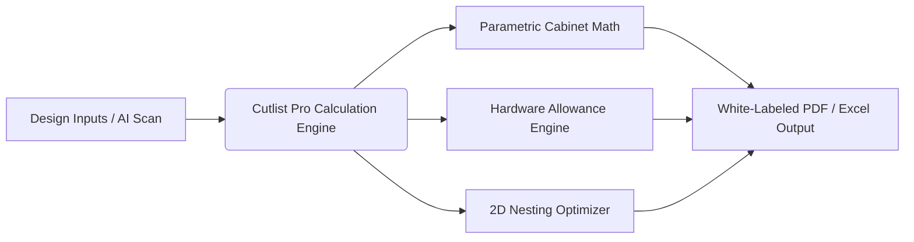

# Proposed Cutlist Software Solution & AI Integration

This document outlines the conceptual blueprint, functional architecture, and artificial intelligence integration for our proposed white-labeled, modular-centric cutlist application tailored for the Indian interior design market.

---

## 1. Product Concept: "Cutlist Pro India"

**Cutlist Pro India** is an offline-first, mobile-responsive, parametric cutlist generator and sheet optimization app. It is designed to act as a bridge between high-end, complex 3D CAD/CAM platforms (which are too expensive) and manual, error-prone paper calculations.



---

## 2. Core Functional Modules

### A. Parametric Cabinet Template Engine
Instead of requiring users to model cabinets panel-by-panel, the app uses pre-configured parametric templates. Users choose a cabinet archetype, input overall outer dimensions, and the engine calculates the cutlist instantly.

*   **Supported Archetypes:**
    *   **Standard Base Cabinet** (1 or 2 shutters, adjustable shelves).
    *   **Sink Base Cabinet** (Open back panel, false top rail for sink bowl clearance, rubber gasket allowances).
    *   **Drawer Pack Cabinet** (Multi-drawer carcass, automatic horizontal partition division).
    *   **Overhead Wall Cabinet** (Solid top, grooved backing on all 4 sides).
    *   **Corner L-Cabinets / Corner Diagonal Units** (Custom calculation for offset panels and blind corners).
    *   **Tall / Pantry Unit** (Mid-height fixed shelves, vertical grain shutter splits).
    *   **Modular Wardrobe Carcass** (Hanger rod clearances, internal drawer boxes, sliding door offsets).

### B. Hardware Allowance Database
One of the largest pain points for Indian carpenters is accounting for hardware tolerances. Our app will feature a built-in database of popular hardware brands in India (Ebco, Hettich, Blum, Hafele) that automatically updates carcass math:

```
                          [User Selects Drawer Runner]
                                       |
             +-------------------------+-------------------------+
             |                                                   |
      [Telescopic Slides]                                [Tandem Drawer Box]
             |                                                   |
- Auto-deducts 26mm total width                    - Reads manufacturer specs (e.g. Blum)
  (13mm per side spacer) for drawer carcass.       - Auto-calculates Drawer Bottom:
                                                     Bottom Width = Inside Width - 75mm
                                                     Bottom Depth = Runner Length - 24mm
```

### C. 2D Nesting & Cut-Layout Optimizer
*   An integrated 2D Bin Packing algorithm (using a fast, client-side JavaScript genetic algorithm or shelf-packer).
*   **Key Controls for Indian Worksheets:**
    *   **Blade Kerf Adjustment:** Set between 2 mm to 4 mm based on the workshop's panel saw blade.
    *   **Grain Matching Constraints:** Force woodgrain to run vertically along the height of the boards for aesthetic matching, or disable for plain laminates to maximize sheet yield.
    *   **Trim Allowances:** Deduct 10mm from sheet boundaries to account for rough edges or factory transport damage on plywood sheets.

### D. Tenant Configuration & White-Labeling Engine
The application is structured to be sold directly to interior design firms and modular factories. It features a robust multi-tenant system allowing complete customization:

1.  **Brand Aesthetics:**
    *   **Logo Upload:** High-res PNG/SVG logo which automatically populates all PDF covers and header bars.
    *   **Color Overrides:** Primary and accent colors match the design firm's brand identity.
2.  **Company Metadata:** Company name, registered address, GSTIN, designer names, workshop coordinates.
3.  **Custom Terms & Conditions:** Pre-formatted disclaimers (e.g., *"Please verify cabinet dimensions with site measurements before cutting. Cutlist Pro is not liable for installation misalignments."*).
4.  **White-Labeled Exports:** PDF cutting sheets, pricing summaries, and assembly diagrams generated with professional typography and the tenant's brand look.

---

## 3. How AI Solves Critical Roadblocks

By introducing AI capabilities, Cutlist Pro India leaps past old legacy software and provides instant value that saves designers hours of manual drafting.

### AI Feature 1: Vision-Based Sketch & Floor Plan Parser
*   **The Roadblock:** Designers often sketch modular layouts on site using graph paper, or have 2D CAD floor plan layouts in AutoCAD. Manually re-entering dozens of cabinet widths, heights, and depths into cutlist software is tedious.
*   **The AI Solution:** Using a vision model (e.g., Gemini 3.5 Flash via API), users take a photo of their hand-drawn cabinetry sketch or upload an AutoCAD elevation image.
*   **How it Works:**
    1.  The user snaps a photo of a kitchen elevation sketch (e.g., showing a series of base cabinets marked "600 Drawer", "900 Hob", "500 Sink").
    2.  The vision model identifies the boundaries, handwriting text, and arrows.
    3.  It outputs structured JSON data containing the cabinet types, positions, and dimensions.
    4.  The app imports this JSON, creating the cabinet list instantly.

```
[Hand-drawn Sketch Image] ---> [Vision AI API] ---> [Structured JSON] ---> [Populated App UI]
```

### AI Feature 2: Voice-to-Cutlist Natural Language Interface
*   **The Roadblock:** Supervisors or carpenters on site often have dusty hands or find typing numbers into a small screen frustrating.
*   **The AI Solution:** A voice-activated command assistant that converts natural speech into parametric cabinets.
*   **Example Phrases Supported:**
    *   *"Add a 2-door base unit, 720 height, 600 width, 18mm marine plywood."*
    *   *"Create a 3-drawer set, Ebco tandem box, 900 wide."*
*   **How it Works:** The app records the voice clip, transcribes it, and uses a lightweight NLP model to extract entities (`height: 720`, `width: 600`, `material: BWP Plywood`, `hardware: Ebco Tandem`) and pushes it into the calculator.

### AI Feature 3: Smart Sheet Optimization Advisor (AI Waste Advisor)
*   **The Roadblock:** Traditional nesting algorithms just lay out rectangles mathematically. They cannot tell you if slightly changing your design could save you massive amounts of money.
*   **The AI Solution:** An intelligent advisor that analyzes the nested sheets and suggests architectural compromises to reduce sheet count.
*   **Example Advisor Scenarios:**
    *   *Scenario:* A designer inputs standard cabinet widths of 600mm. The nesting engine calculates that it needs 4.1 plywood sheets, which forces the designer to buy an entire 5th sheet for a tiny panel.
    *   *AI Suggestion:* *"If you reduce the width of your filler panel by 15mm or adjust one base cabinet to 585mm, all parts will fit perfectly onto 4 sheets instead of 5, saving you 20% on materials (approx. ₹3,500)."*

---

## 4. Proposed Technical Architecture

To make this highly usable on construction sites and factory floors in India (where internet connection is often spotty), the app must be built with a modern, fast, **offline-first** technology stack.

```
+-------------------------------------------------------------------------+
|                              USER INTERFACE                             |
|    HTML5 / Vanilla CSS or Tailwind CSS / React (Responsive web app)     |
+------------------------------------+------------------------------------+
                                     |
                                     v
+------------------------------------+------------------------------------+
|                         OFFLINE-FIRST CORE                              |
|   1. Calculation Engine: Parametric formulas in pure JS                 |
|   2. LocalStorage / IndexedDB: Saves project lists locally without net  |
|   3. Client-Side Nesting Algorithm: 2D Packing in Web Workers           |
+------------------------------------+------------------------------------+
                                     |
                                     v
+------------------------------------+------------------------------------+
|                          CLOUD SERVICES (Sync)                         |
|   1. Supabase Backend: Multi-tenant profiles, custom logos, shared catalogs|
|   2. Gemini API: Image-to-JSON OCR parsing and voice NLP modules        |
|   3. PDF Generator: Cloud/Client-side high-quality vector PDF reports   |
+-------------------------------------------------------------------------+
```

### Technical Benefits of This Stack:
1.  **Fast Loading:** Zero-friction entry page. Runs directly inside any mobile browser (Safari/Chrome).
2.  **Offline-Capable:** A carpenter can open the app on a construction site, calculate all cuts, view the layouts, and export a PDF even if there is zero mobile signal.
3.  **Low Operating Costs:** Processing calculations on the client side means the hosting server doesn't require expensive high-end CPU nodes. Cloud costs are kept near zero, allowing high profit margins when sold as a SaaS product.
