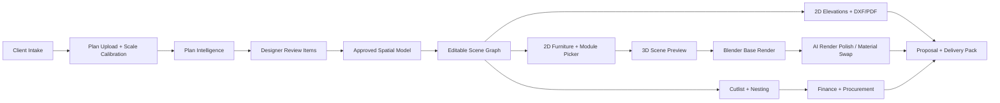

# Ultimate Interior Design App Completion Plan

Date: 2026-07-13

## Plan Of Record

This document remains the architecture master plan. The governing product rules and implementation discipline are maintained in [ULTIDA_ULTIMATUM.md](ULTIDA_ULTIMATUM.md), [ULTIDA_LIFECYCLE_CONTRACTS.md](ULTIDA_LIFECYCLE_CONTRACTS.md), [ULTIDA_PHASE_EXECUTION_PLAYBOOK.md](ULTIDA_PHASE_EXECUTION_PLAYBOOK.md), [ULTIDA_TOOL_QUALITY_STANDARD.md](ULTIDA_TOOL_QUALITY_STANDARD.md), and [ULTIDA_EXECUTION_TRACKER.md](ULTIDA_EXECUTION_TRACKER.md). When documents conflict, the Ultimatum and scene-version lineage rules take precedence.

## Product Goal

Build a cloud-ready interior design operating system that turns a client brief plus floor plan into a dimension-aware project package:

client intake -> CAD/plan intelligence -> floor plan analysis -> floor plan enhancer -> scene graph -> 2D furniture picker -> per-space 3D renders -> 2D drawings/elevations -> material swapper -> cutlist -> finance -> presentation/delivery.

The first customer-demo workflow is 3D renders plus 2D elevations. Every later module must preserve that geometry truth instead of generating isolated images.

## Current App State

The main runnable app is the root React/Vite frontend plus Express/SQLite backend:

- Frontend: `frontend/src/App.jsx`, `frontend/src/screens`, `frontend/src/components/design3d`, `frontend/src/stores/editorStore.js`.
- Backend: `server/index.js`, `server/services`, `server/database/database.js`.
- Built frontend output: `dist`.
- Spec/prototype work: `ai_build_spec`, `spacious-venture-onboarding`, and `cutlist` are useful references, not the primary running app.

The current schema already supports the correct backbone:

- `floor_plan_versions` and `floor_plan_review_items` for plan interpretation and designer review.
- `spatial_model_versions` for room/wall/opening/furniture understanding.
- `scene_versions` for editable geometry, branching, locking, and approval.
- `design_renders`, `render_generation_jobs`, `render_corrections`, and `laminate_swap_history` for visual output and iterative corrections.
- `material_catalog`, `production_cutlists`, `budget_profiles`, `estimate_sets`, `payment_plans`, `variation_orders`, and `purchase_orders` for production and commercial workflows.

## Non-Negotiable Product Rules

1. Geometry is the source of truth.
   Renders, elevations, cutlists, and finance must derive from the same scene graph.

2. AI rendering is not allowed to invent dimensions.
   AI may polish, relight, restyle, or inpaint, but exact layout, wall lengths, cabinet sizes, furniture scale, openings, ceiling rules, and material zones must come from the plan/scene data.

3. Designer edits must be first-class.
   Every generated output needs review, correction, approval, and version history.

4. Kitchen and furniture rules must be dimension-aware.
   Example: a 3800 mm wall should force real sofa sizing and placement constraints. Kitchen mesh baskets, rolling shutters, laminate swaps, ceiling choices, and appliance placements must be represented as structured components, not loose prompt text.

5. Elevations must be production readable.
   A3 landscape sheets, white background, clean tags, chained and overall dimensions, oblique dimension ticks, material schedule, and no clutter inside the viewport.

## Best Stack

Keep the current stack for the near-term product because it already runs:

- App frontend: React + Vite + Three.js.
- Backend: Node + Express.
- Current local data: SQLite.
- Production data: Postgres plus object storage for uploads, renders, PDFs, DXFs, GLBs, and packaged deliverables.
- Background jobs: queue-backed workers for plan analysis, render generation, elevation exports, cutlists, and proposal packs.
- Interactive 3D: Three.js now; upgrade the editor layer to React Three Fiber only when the current imperative viewport becomes too hard to maintain.
- Deterministic photoreal rendering: Blender headless/Cycles from scene JSON for geometry-faithful base renders.
- AI visual enhancement: OpenAI image generation/editing or ComfyUI workflows as a second stage, never as the geometry source.
- CAD automation: current DXF/PDF generators first; Autodesk Platform Services only when true DWG automation, plotting, or AutoCAD cloud execution becomes required.
- AURA model: begin with rules + retrieval + structured tool calls. Train a sub-1GB LoRA/tiny model only after enough correction data exists.

## Target Architecture



## Phase 0: Stabilize The Demo App

Goal: make the current app reliable enough to show.

- Keep the root app as the main app.
- Remove hard-coded `127.0.0.1:5055` frontend API calls and centralize API base URL so `.env PORT=8787` does not break data loading.
- Keep `/api/health` and the production static frontend serving path.
- Add a startup preflight that checks database, build output, API health, provider status, and writable storage.
- Add a visible "Demo Ready" mode that opens directly into a seeded project with a floor plan, scene, render, elevation, material swap, and cutlist.

Exit criteria:

- `npm run build` passes.
- The app opens from the production URL.
- Health endpoint returns success.
- One seeded project can move from brief to render/elevation without manual database changes.

## Phase 1: Render + Elevation Demo Slice

Goal: first customer demo centered on the highest-value workflow.

Build one polished path:

1. Upload or pick floor plan.
2. Confirm scale using one known dimension.
3. Auto-detect rooms, walls, openings, and furniture candidates.
4. Designer approves corrections.
5. Generate editable scene.
6. Place kitchen/wardrobe/sofa modules in 2D.
7. Preview in 3D.
8. Generate one photoreal render per selected room.
9. Generate A3 PDF elevation and DXF for the same wall/modules.

For the render pipeline:

- Scene JSON -> Blender script -> base render with correct dimensions, camera, lighting, and materials.
- Base render + masks/depth/edge maps -> AI enhancement.
- Save render job, prompts, seed, input images, material assignments, and correction notes.

For the elevation pipeline:

- Scene JSON -> wall projection -> cabinet/module rectangles -> dimensions -> tags -> material schedule -> PDF/DXF.
- Use the A3 elevation rules from `pdf-elevation-generator`.

Exit criteria:

- The render and elevation visibly agree with each other.
- Changing a module width updates 3D preview, render payload, elevation, cutlist, and quote state.

## Phase 2: Plan Intelligence And Floor Plan Enhancer

Goal: make plans usable even when the upload is messy.

- Add explicit scale calibration with mm/m/ft support.
- Build review items for low-confidence walls, openings, text labels, room names, and dimensions.
- Add "floor plan enhancer" tools: straighten walls, close gaps, align openings, normalize labels, and generate clean black-and-white plan output.
- Store raw interpretation, reviewed interpretation, and approved spatial model separately.
- Add confidence heatmap and "needs designer decision" queue.

Exit criteria:

- No generated scene is allowed until critical review items are approved.
- Every auto-correction is reversible and stored.

## Phase 3: Scene Graph And Furniture System

Goal: the designer works on a real model, not separate screens.

- Make scene modules parametric: roomRef, wallRef, x/y/z, width/height/depth, material slots, hardware, service clearances, production flags.
- Convert furniture catalog into real typed objects: sofa, bed, wardrobe, kitchen base, kitchen wall, rolling shutter, mesh basket, sink, hob, tall unit, TV unit, pooja, study, shoe rack.
- Add constraints:
  - no furniture crossing doors/windows,
  - wall-fit checks,
  - circulation clearance,
  - appliance/service placement,
  - sofa size by wall length,
  - kitchen work zone validation,
  - ceiling/lighting rules from client brief.
- Add scene branching: concept A/B, client approved, production locked.

Exit criteria:

- A designer can edit dimensions directly and see all downstream outputs become stale until regenerated.

## Phase 4: Materials And Material Swapper

Goal: material changes preserve geometry.

- Material slots per component: carcass, shutter, countertop, backsplash, hardware, panel, mesh, glass, lighting, wall, floor, ceiling.
- Link materials to catalog SKUs, brand, finish, price, availability, and supplier.
- Use masks/component IDs for AI material swaps.
- Add "keep everything else same" mode for laminate swaps.
- Record every swap in `laminate_swap_history` with before/after, prompt, material code, and approval.

Exit criteria:

- Kitchen laminate changes do not move baskets, rolling shutters, appliances, lighting, or camera.

## Phase 5: Cutlist, Finance, And Procurement

Goal: make the beautiful design buildable.

- Convert approved scene modules into board parts, edge bands, hardware, accessories, and labor items.
- Add production presets for Indian modular interiors: plywood/HDHMR/MDF, BWP/BWR, laminate thickness, edge banding, channels, hinges, handles, baskets.
- Generate cutlist, nesting, quote, GST invoice, payment schedule, variation order, and purchase order from the same estimate set.
- Lock production packages after sign-off.

Exit criteria:

- A signed design produces a downloadable cutlist + quote + material schedule without retyping.

## Phase 6: Presentation And Delivery

Goal: client and factory receive clean packs.

- Client pack: brief, moodboard, plan, renders, material palette, cost summary, approval buttons.
- Factory pack: elevations, DXF, cutlist, hardware schedule, material schedule, site notes.
- Audit pack: version history, approvals, variations, payments.
- Share links with permission levels.

Exit criteria:

- One project can be delivered as a single signed-off package.

## AURA Tiny Model Plan

Do not start by training a big model. Use AURA as an orchestrator first:

- Rules: kitchen, wardrobe, vastu, lighting, sofa sizing, elevation sheet standards.
- Retrieval: material catalogs, prior corrections, approved designs, product specs.
- Tools: plan analyzer, scene editor, render job creator, elevation generator, cutlist calculator.

When enough data exists, train a tiny sub-1GB assistant:

- Candidate base: 0.5B-0.6B class instruct model or smaller.
- Method: LoRA/SFT, not full fine-tune.
- Training data: designer corrections, render mistake/correction pairs, plan review resolutions, material swap instructions, elevation rules.
- Output contract: JSON actions and tool calls, not free-form design claims.

Exit criteria:

- AURA can propose structured actions like "resize sofa to 2600 mm for 3800 mm wall" or "move mesh basket below rolling shutter" with confidence and reasoning.

## Kitchen Design Rules To Teach The App

- Intake must ask cooking style, storage volume, appliances, gas/electric, water purifier, chimney, vegetable basket, pantry, tall units, rolling shutter, counter material, backsplash, lighting, and cleaning preferences.
- Layout must validate sink/hob/fridge relationships, clear walking widths, door/window conflicts, service points, and ventilation.
- Cabinet modules must include standard base, wall, tall, corner, sink, hob, drawer, mesh basket, rolling shutter, loft, and appliance garage.
- Every kitchen render prompt must include explicit negative constraints from the brief, such as "no false ceiling" or "no strip lights" when selected.
- Material swaps must affect only requested surfaces.
- Production output must include cabinet elevations, carcass/shutter dimensions, hardware schedule, accessories, countertop/backsplash, and site notes.

## Immediate Next Build Order

1. Centralize API base URL and make all screens respect the active backend port.
2. Create one seeded demo project: client brief, calibrated plan, kitchen/living scene, render record, elevation record, cutlist, quote.
3. Build scene-to-elevation consistency check.
4. Build scene-to-Blender base render exporter.
5. Add material mask/component IDs for exact laminate swaps.
6. Add designer review queue for plan intelligence.
7. Add delivery pack generator that combines render, elevation, quote, and cutlist.

## Canonical Phase 4-10 Execution Plan

This section supersedes the older phase numbering above. It is the one active plan for the remainder of the product. The existing tools stay available, but new work must attach to the contracts in this section rather than create a parallel implementation.

### Live Implementation Status

- **Completed:** upload-shell crash fix for the Command Center floor-plan flow; invalid event-handler hook calls removed; production build and API preflight restored.
- **Completed:** initial `scene.v1` normalizer, millimetre validation, stable entity IDs, deterministic scene hash, project/floor-plan lineage, approval metadata, lock/unlock ownership checks, and `scene_artifacts` stale dependency ledger.
- **Verified:** scene-schema tests, floor-plan/scene tests, all 35 screen smoke checks, server syntax, production build, and live `/api/health` plus `/api/projects/:id/scene-artifacts` checks.
- **In progress:** migrate every drawing, render, cutlist, estimate, and delivery writer to consume the normalized snapshot; expand kitchen/wardrobe/sofa/circulation rules; add cross-output golden fixtures.
- **Next implementation pass:** create the single render package contract and route the existing Blender paths through it, then add render provenance and scene-version consistency tests.

### Architecture Decision Record

1. `scene_versions` is the immutable design truth after plan approval. A render, drawing, cutlist, estimate, purchase order, and delivery pack must carry `sceneVersionId` and `sceneHash`.
2. `floor_plan_versions` remains the truth for raw/reviewed/approved plan evidence. A scene records the approved floor-plan version from which it was created.
3. Derived outputs are never edited in place. A new material, geometry, or layout change creates a new scene version and marks dependent artifacts stale.
4. AI is an assistant around this system. It may propose structured changes and produce clearly labelled visual polish, but it cannot write unreviewed geometry or masquerade as a deterministic render.
5. No generator is deleted on the basis of a code search alone. Compatibility fixtures must prove equivalent dimensions, layers, and readable output first.

### Scene Snapshot v1 Contract

Every approved scene snapshot must have this normalized shape before it can enter rendering, drawings, production, commercial, or delivery workflows:

```json
{
  "schemaVersion": "scene.v1",
  "units": "mm",
  "projectId": "proj_x",
  "floorPlanVersionId": "fpv_x",
  "sceneVersionId": "scene_x",
  "approval": { "state": "approved", "lockedAt": "ISO-8601", "reason": "Client sign-off" },
  "levels": [{
    "id": "level_ground",
    "rooms": [{ "id": "room_kitchen", "type": "kitchen", "polygon": [] }],
    "walls": [{ "id": "wall_01", "startMm": {}, "endMm": {}, "thicknessMm": 115, "heightMm": 2700 }],
    "openings": [{ "id": "opening_01", "wallId": "wall_01", "kind": "door", "offsetMm": 900, "widthMm": 900, "sillMm": 0, "headMm": 2100 }],
    "modules": [{ "id": "module_01", "kind": "kitchen_base", "roomId": "room_kitchen", "wallId": "wall_01", "xOffsetMm": 0, "widthMm": 600, "heightMm": 720, "depthMm": 560, "materialSlots": {}, "hardware": [], "services": [], "clearances": [] }],
    "looseFurniture": [],
    "lighting": [],
    "ceiling": [],
    "services": []
  }],
  "production": { "materialSchedule": [], "hardwareSchedule": [], "siteNotes": [] }
}
```

Entity IDs must remain stable across edits. All measurements are millimetres. Legacy `rooms`, `furniture`, `placed_modules`, and `room_shell` payloads are read only through an explicit normalizer until migrated; no new route may write a legacy shape.

### Phase 4: Canonical Scene and Design Validation

**Outcome:** one versioned, typed, lockable scene graph that every tool can read.

1. Add `scene-schema.js` for schema validation, normalization, stable entity IDs, hash generation, and migration adapters.
2. Add `scene-dependency-service.js` to record derived artifact dependencies and stale reasons. Replace ad hoc project-level stale flags with per-artifact linkage while retaining the existing flags as a dashboard summary.
3. Make scene creation require an approved floor-plan version. A permitted override must include an actor, reason, and audit entry.
4. Make lock behavior server-enforced: locked scenes reject geometry/material changes; a change creates a child version or requires an explicit unlock audit event.
5. Expand geometry validation around the normalized snapshot:
   - room polygon validity, wall continuity, opening-to-wall alignment, and dimension unit checks;
   - doors, windows, and circulation collision checks;
   - kitchen work triangle, service zones, standard modular dimensions, appliance clearances, rolling shutter and mesh-basket relationships;
   - wardrobe access, loft clearance, and hardware feasibility;
   - sofa scale relative to wall length and circulation;
   - ceiling, lighting, plumbing, electrical, and AC service conflicts.
6. Return structured issue objects with entity IDs, severity, proposed correction, rule reference, and blocking state. AURA and the UI consume the same issue format.

**Exit gate:** a kitchen and living-room fixture create a normalized scene; a geometry change creates a new scene version and marks the correct render, drawing, cutlist, estimate, and delivery artifacts stale.

### Phase 5: Deterministic Render Pipeline and Provenance

**Outcome:** an approved scene produces a reproducible Cycles base render; AI is optional and visibly secondary.

**Implementation status (2026-07-16):** the first production backbone is complete: `scene-render-package.js` creates a stable `render-package.v1` manifest from normalized `scene.v1` geometry; the Blender route records the package, scene hash, camera, Cycles settings, base/mask URLs, approval state, and source kind in `render_artifacts`; and production requests reject draft scenes before any render process begins. The Blender script now reads `scene.v1` geometry before legacy `room_shell` data and falls back to CPU when CUDA is unavailable. Remaining Phase 5 work is typed openings/fixtures, depth and normal passes, AI polish lineage, and queue retry/cancellation states.

1. Replace the overlapping `scene-to-blender.js` execution path and `blender-renderer.js` execution path with three layers:
   - `scene-render-package.js`: normalized scene plus camera, lighting, materials, object IDs, masks, and a deterministic package hash;
   - `blender-renderer.js`: the only headless Blender/Cycles executor;
   - `render-polish-service.js`: AI edit/inpaint/relight/material-swap jobs that accept only the base render plus component masks.
2. Upgrade Blender export to create actual wall openings, typed module geometry, material slots, fixtures, lights, camera presets, depth/normal/ID masks, and a manifest. The current simple boxes are a draft adapter, not a professional final renderer.
3. Add `render_artifacts` provenance fields: `scene_version_id`, `scene_hash`, `render_package_hash`, `camera_preset`, `blender_version`, `cycles_settings`, `base_image_url`, `mask_urls`, `provider`, `model`, `seed`, `prompt`, `negative_prompt`, `is_synthetic`, `source_kind`, `parent_render_id`, and `approval_state`.
4. A no-key path may return a `curated-reference` only when `isSynthetic: true` and the UI says “Reference image, not project render.” It must never occupy the approved render slot.
5. Material swaps must select scene material-slot IDs and mask IDs. “Keep everything else the same” means camera, geometry package hash, and non-target slots are immutable.
6. Add job idempotency, retry states, cancellation, output checksums, and a render queue visible in the command center.

**Exit gate:** the same approved scene and camera create the same Blender payload. The elevation and render have matching module dimensions. An AI material swap changes only allowed slot masks and retains source provenance.

### Phase 6: Drawings, DXF, PDF, and Production Data

**Outcome:** the factory receives measured, version-linked production documents generated from the approved scene.

**Implementation status (2026-07-16):** `scene-drawing-projection.js` now converts approved `scene.v1` geometry into shared drawing primitives. Canonical scene-versioned floor-plan DXF, wall-elevation DXF, and elevation PDF routes are live; draft scenes are rejected before export, and output filenames/revision metadata carry the source scene version. Existing CAD and specialist generators remain available for compatibility while comparison fixtures are expanded. Remaining work is RCP/sections/schedules, full module projection into every drawing type, output checksums/ledger records, and cross-output dimension fixtures.

1. Create `drawing-projection-service.js` to convert the normalized scene into shared 2D primitives: plans, wall elevations, RCP, sections, dimensions, tags, schedules, and notes.
2. Create `drawing-export-service.js` as the only production route facade. It consumes drawing primitives and emits DXF or vector PDF.
3. Use `dxf-writer.js` as the R2010 envelope and floor-plan primitive writer; migrate the richer elevation geometry from `dxf-generator.js` behind the same service. Do not designate either old route as canonical until fixtures pass.
4. Keep `frontend/src/utils/dxf-exporter.js` as an offline drafting preview only. Keep static kitchen scripts as fixtures. Block all of them from approved delivery-pack exports.
5. Consolidate `dxf-validate.js` and `validate-dxf.js` into one importable validator. Validate ASCII group pairs, sections, declared layers, entity subclasses, unit header, extents, and source version metadata.
6. Standardize layers: `WALL_OUTLINE`, `OPENINGS`, `FURNITURE`, `CABINETRY`, `CEILING`, `SERVICES`, `DIMENSIONS`, `ANNOTATIONS`, `SCHEDULE`, and `REF_LINES`.
7. Generate floor plan, elevations, reflected ceiling plan, material/hardware schedule, cutlist, nesting, CNC files, and site notes from one approved scene snapshot. Every sheet contains project, scene version, scale, revision, date, and approval status.

**Exit gate:** AutoCAD, LibreCAD, and the structural validator open fixture DXFs without repair prompts; vector PDFs visually match their DXF source; chained and overall dimensions reconcile to scene geometry.

### Phase 7: Commercial and Factory Operations

**Outcome:** commercial commitments and procurement are traceable to a scene version and the production package.

**Implementation status (2026-07-16):** cutlist projects, cutlist revisions, production cutlists, estimates, invoices, payment plans, variations, and purchase orders now carry scene-version lineage. Production package, nesting, purchase orders, factory work orders, and scene-linked finance creation reject missing or unapproved scene inputs. Payment plans and invoices expose their source scene, purchase orders have procurement status transitions, factory work orders are generated from the approved scene plus cutlist/PO scope, and commercial summary reports contract value, committed cost, margin, billed, received, and outstanding amounts. Existing legacy records remain readable through the current adapters. Remaining work is vendor catalog comparison, richer factory capacity/scheduling, variation approval/repricing against branched scenes, and cross-output commercial consistency fixtures.

1. Select one canonical cutlist persistence shape. Provide a read adapter for the current `cutlist_projects` and `production_cutlists` records during migration, then migrate existing data and prevent dual writes.
2. Create estimate sets from cutlist parts, material slots, hardware, labor, services, taxes, and margin rules. An estimate cannot be approved without a `sceneVersionId`.
3. Add alternatives as explicit estimate/scene branches, never as overwritten prices.
4. Implement GST quotation, payment milestones, variation orders, vendor comparison, purchase orders, procurement status, factory work orders, promised dates, actual dates, and margin variance. The current API baseline is scene-linked; the next increment should add vendor comparison and explicit variation approval/repricing against a new scene branch.
5. Treat a post-approval geometry/material edit as a variation: it identifies affected parts, cost delta, schedule delta, client approval, and revised production package.

**Exit gate:** a scene-linked kitchen produces a BOM, nesting, GST quote, payment plan, purchase order, and factory work order without manual re-entry; a width change produces a measurable variation.

### Phase 8: Presentation, Delivery, Installation, and Service

**Outcome:** client, factory, and installation teams receive the right versioned package for their role.

1. Build client packs from approved render artifacts, plans, elevations, material palette, scope, estimate, timeline, and approval decisions.
2. Build factory packs from approved DXF/PDF drawings, cutlist, nesting, hardware/material schedule, service points, site notes, and revision log.
3. Add signed approval capture, expiring permissioned share links, immutable signature/audit records, and package manifests.
4. Add installation checklists, room-by-room snag lists with photos, handover documents, warranty registration, service tickets, and project-close analytics.
5. Present stale status prominently: a pack can be viewed as historical, but cannot be issued as current after a dependent change without an explicit override record.

**Exit gate:** one project can issue a client pack and a factory pack, record approval, complete installation checks, register warranty, and close with a versioned audit trail.

### Phase 9: Lifecycle Command Center and Navigation

**Outcome:** the interface reads as one operating system, not a catalogue of specialist screens.

1. Use fixed lifecycle stages: `Intake`, `Plan`, `Review`, `Scene`, `Visualize`, `Drawings`, `Production`, `Commercial`, `Delivery`, `Aftercare`.
2. The command center top band shows active project, approved scene revision, readiness, next deliverable, and an explicit blocker.
3. The main area shows the one current workspace. The right rail shows approvals, queued jobs, stale artifacts, cost/margin health, and decisions requiring attention.
4. Specialist tools are contextual launch points within the relevant stage. They remain searchable from a global command palette, but are not presented as competing primary navigation items.
5. Keep the workflow navigation collapsible and remember its state. Prioritize canvas area in Plan, Scene, Render, and Drawing stages.
6. AURA is a stage-aware command layer: it proposes actions, opens the correct workspace, explains validation failures, and creates reviewable jobs. It never bypasses stage gates.

**Exit gate:** a new designer can identify the current project state, blocked decision, next action, approved scene, and most recent output without opening more than one workspace.

### Phase 10: Release Gates, Reliability, and Deployment

**Outcome:** no customer is asked to trust an unverified plan, render, drawing, or commercial document.

1. Create golden kitchen and living-room fixtures with known dimensions, materials, openings, and expected downstream artifact checksums/measurements.
2. Add cross-output tests: scene-to-render package, scene-to-elevation, scene-to-DXF, scene-to-cutlist, scene-to-estimate, and material-swap invariants.
3. Add DXF structural tests plus application-open smoke tests using AutoCAD-compatible tooling where available.
4. Add cold-start migration, concurrent startup, provider truthfulness, job retry/idempotency, access control, rate limit, file-upload safety, backup/restore, and rollback tests.
5. Add browser visual tests at desktop and tablet widths. Check that canvas surfaces are usable, navigation is collapsible, text does not overlap, and render/drawing previews are nonblank.
6. Deploy with managed Postgres, object storage, queue workers, secrets management, backups, monitoring, alerting, signed artifact URLs, and a rollback runbook. SQLite remains a local development adapter only.

**Exit gate:** clean deployment succeeds from an empty database; fixture workflow passes end to end; restore drill succeeds; provider fallback is honest; a failed deployment can be rolled back without losing approved project data.

### Exact Implementation Order

1. Publish `scene.v1` schema and fixtures; adapt legacy scenes without changing the editor UI.
2. Add scene dependency/stale artifact records and approval enforcement.
3. Build render packages and route both existing Blender paths through one executor.
4. Build common drawing primitives; compare every current DXF generator against golden fixtures.
5. Introduce one drawing export facade and migrate floor-plan/elevation routes to it.
6. Consolidate cutlist persistence and link estimate sets to scene versions.
7. Build versioned delivery packages and the lifecycle command center.
8. Add release gates before removing old generators or broadening AI capability.

## Research Notes

- Three.js remains the right browser interaction layer for WebGL/WebGPU, glTF, controls, and previews.
- Blender supports command-line/headless rendering and Cycles, making it the correct deterministic render engine for geometry-faithful base renders.
- OpenAI image generation/editing is appropriate as a polish/edit stage after deterministic geometry is created.
- ComfyUI is useful as a controllable visual workflow backend when local or self-hosted diffusion workflows are needed.
- Autodesk Platform Services Automation APIs are a later-stage option for cloud CAD/DWG automation and plotting, not required for the first demo.
- Hugging Face TRL/SFT with LoRA is suitable for a future small AURA model once enough domain examples exist.

## Current Restructuring Controls

The implementation is governed by `docs/ULTIDA_PRODUCT_ULTIMATUM.md`. The repository surface is inventoried in `docs/ULTIDA_TOOL_INVENTORY.md` and can be re-scanned with `node scripts/ultida-tool-inventory.mjs --json`.

The inventory found 26 lifecycle capabilities across 35 frontend screens, 125 server services, 230 API route declarations, 18 Python tools, and 2,227 stored/public assets. The next consolidation work must address the registry/API/UI mismatches before claiming the app is one product:

1. Route the registry-only document parser, media upscaler, and design-zone namespaces or explicitly retire them from the registry.
2. Attach plan enhancement, render, material swap, DXF/PDF, cutlist, quote, and delivery manifests to exact scene versions and approval states.
3. Bring section/RCP, photo-to-elevation, CNC/G-code, Vastu, SketchUp, and reference-library capabilities into the active lifecycle surface without duplicating geometry.
4. Keep generated storage and historical client deliverables separate from source code and never delete tracked deliverables as part of a feature change.
5. Replace the current dark-first shell incrementally with `frontend/src/styles/cozy-theme.css`, following `docs/COZY_UI_DIRECTION.md`.

The product is not considered complete until the golden kitchen and living fixtures pass the cross-output gates in `docs/SCENE_OUTPUT_CONSISTENCY_GATES.md` and the release gates in Phase 10.
