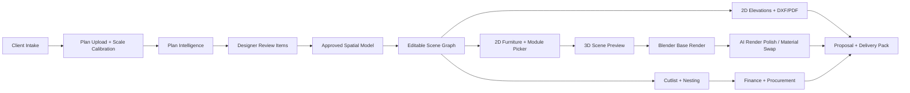

# Ultimate Interior Design App Completion Plan

Date: 2026-07-13

## Product Goal

Build a cloud-ready interior design operating system that turns a client brief plus floor plan into a dimension-aware project package:

client intake -> CAD/plan intelligence -> floor plan analysis -> floor plan enhancer -> scene graph -> 2D furniture picker -> per-space 3D renders -> 2D drawings/elevations -> material swapper -> cutlist -> finance -> presentation/delivery.

The first customer-demo workflow is 3D renders plus 2D elevations. Every later module must preserve that geometry truth instead of generating isolated images.

## Current App State

The main runnable app is the root React/Vite frontend plus Express/SQLite backend:

- Frontend: `frontend/src/App.jsx`, `frontend/src/screens`, `frontend/src/components/design3d`, `frontend/src/stores/editorStore.js`.
- Backend: `server/index.js`, `server/services`, `server/database/database.js`.
- Built frontend output: `dist`.
- Spec/prototype work: `ai_build_spec`, `spacious-venture-onboarding`, and `cutlist` are useful references, not the primary running app.

The current schema already supports the correct backbone:

- `floor_plan_versions` and `floor_plan_review_items` for plan interpretation and designer review.
- `spatial_model_versions` for room/wall/opening/furniture understanding.
- `scene_versions` for editable geometry, branching, locking, and approval.
- `design_renders`, `render_generation_jobs`, `render_corrections`, and `laminate_swap_history` for visual output and iterative corrections.
- `material_catalog`, `production_cutlists`, `budget_profiles`, `estimate_sets`, `payment_plans`, `variation_orders`, and `purchase_orders` for production and commercial workflows.

## Non-Negotiable Product Rules

1. Geometry is the source of truth.
   Renders, elevations, cutlists, and finance must derive from the same scene graph.

2. AI rendering is not allowed to invent dimensions.
   AI may polish, relight, restyle, or inpaint, but exact layout, wall lengths, cabinet sizes, furniture scale, openings, ceiling rules, and material zones must come from the plan/scene data.

3. Designer edits must be first-class.
   Every generated output needs review, correction, approval, and version history.

4. Kitchen and furniture rules must be dimension-aware.
   Example: a 3800 mm wall should force real sofa sizing and placement constraints. Kitchen mesh baskets, rolling shutters, laminate swaps, ceiling choices, and appliance placements must be represented as structured components, not loose prompt text.

5. Elevations must be production readable.
   A3 landscape sheets, white background, clean tags, chained and overall dimensions, oblique dimension ticks, material schedule, and no clutter inside the viewport.

## Best Stack

Keep the current stack for the near-term product because it already runs:

- App frontend: React + Vite + Three.js.
- Backend: Node + Express.
- Current local data: SQLite.
- Production data: Postgres plus object storage for uploads, renders, PDFs, DXFs, GLBs, and packaged deliverables.
- Background jobs: queue-backed workers for plan analysis, render generation, elevation exports, cutlists, and proposal packs.
- Interactive 3D: Three.js now; upgrade the editor layer to React Three Fiber only when the current imperative viewport becomes too hard to maintain.
- Deterministic photoreal rendering: Blender headless/Cycles from scene JSON for geometry-faithful base renders.
- AI visual enhancement: OpenAI image generation/editing or ComfyUI workflows as a second stage, never as the geometry source.
- CAD automation: current DXF/PDF generators first; Autodesk Platform Services only when true DWG automation, plotting, or AutoCAD cloud execution becomes required.
- AURA model: begin with rules + retrieval + structured tool calls. Train a sub-1GB LoRA/tiny model only after enough correction data exists.

## Target Architecture

## Phase 0: Stabilize The Demo App

Goal: make the current app reliable enough to show.

- Keep the root app as the main app.
- Remove hard-coded `127.0.0.1:5055` frontend API calls and centralize API base URL so `.env PORT=8787` does not break data loading.
- Keep `/api/health` and the production static frontend serving path.
- Add a startup preflight that checks database, build output, API health, provider status, and writable storage.
- Add a visible "Demo Ready" mode that opens directly into a seeded project with a floor plan, scene, render, elevation, material swap, and cutlist.

Exit criteria:

- `npm run build` passes.
- The app opens from the production URL.
- Health endpoint returns success.
- One seeded project can move from brief to render/elevation without manual database changes.

## Phase 1: Render + Elevation Demo Slice

Goal: first customer demo centered on the highest-value workflow.

Build one polished path:

1. Upload or pick floor plan.
2. Confirm scale using one known dimension.
3. Auto-detect rooms, walls, openings, and furniture candidates.
4. Designer approves corrections.
5. Generate editable scene.
6. Place kitchen/wardrobe/sofa modules in 2D.
7. Preview in 3D.
8. Generate one photoreal render per selected room.
9. Generate A3 PDF elevation and DXF for the same wall/modules.

For the render pipeline:

- Scene JSON -> Blender script -> base render with correct dimensions, camera, lighting, and materials.
- Base render + masks/depth/edge maps -> AI enhancement.
- Save render job, prompts, seed, input images, material assignments, and correction notes.

For the elevation pipeline:

- Scene JSON -> wall projection -> cabinet/module rectangles -> dimensions -> tags -> material schedule -> PDF/DXF.
- Use the A3 elevation rules from `pdf-elevation-generator`.

Exit criteria:

- The render and elevation visibly agree with each other.
- Changing a module width updates 3D preview, render payload, elevation, cutlist, and quote state.

## Phase 2: Plan Intelligence And Floor Plan Enhancer

Goal: make plans usable even when the upload is messy.

- Add explicit scale calibration with mm/m/ft support.
- Build review items for low-confidence walls, openings, text labels, room names, and dimensions.
- Add "floor plan enhancer" tools: straighten walls, close gaps, align openings, normalize labels, and generate clean black-and-white plan output.
- Store raw interpretation, reviewed interpretation, and approved spatial model separately.
- Add confidence heatmap and "needs designer decision" queue.

Exit criteria:

- No generated scene is allowed until critical review items are approved.
- Every auto-correction is reversible and stored.

## Phase 3: Scene Graph And Furniture System

Goal: the designer works on a real model, not separate screens.

- Make scene modules parametric: roomRef, wallRef, x/y/z, width/height/depth, material slots, hardware, service clearances, production flags.
- Convert furniture catalog into real typed objects: sofa, bed, wardrobe, kitchen base, kitchen wall, rolling shutter, mesh basket, sink, hob, tall unit, TV unit, pooja, study, shoe rack.
- Add constraints:
  - no furniture crossing doors/windows,
  - wall-fit checks,
  - circulation clearance,
  - appliance/service placement,
  - sofa size by wall length,
  - kitchen work zone validation,
  - ceiling/lighting rules from client brief.
- Add scene branching: concept A/B, client approved, production locked.

Exit criteria:

- A designer can edit dimensions directly and see all downstream outputs become stale until regenerated.

## Phase 4: Materials And Material Swapper

Goal: material changes preserve geometry.

- Material slots per component: carcass, shutter, countertop, backsplash, hardware, panel, mesh, glass, lighting, wall, floor, ceiling.
- Link materials to catalog SKUs, brand, finish, price, availability, and supplier.
- Use masks/component IDs for AI material swaps.
- Add "keep everything else same" mode for laminate swaps.
- Record every swap in `laminate_swap_history` with before/after, prompt, material code, and approval.

Exit criteria:

- Kitchen laminate changes do not move baskets, rolling shutters, appliances, lighting, or camera.

## Phase 5: Cutlist, Finance, And Procurement

Goal: make the beautiful design buildable.

- Convert approved scene modules into board parts, edge bands, hardware, accessories, and labor items.
- Add production presets for Indian modular interiors: plywood/HDHMR/MDF, BWP/BWR, laminate thickness, edge banding, channels, hinges, handles, baskets.
- Generate cutlist, nesting, quote, GST invoice, payment schedule, variation order, and purchase order from the same estimate set.
- Lock production packages after sign-off.

Exit criteria:

- A signed design produces a downloadable cutlist + quote + material schedule without retyping.

## Phase 6: Presentation And Delivery

Goal: client and factory receive clean packs.

- Client pack: brief, moodboard, plan, renders, material palette, cost summary, approval buttons.
- Factory pack: elevations, DXF, cutlist, hardware schedule, material schedule, site notes.
- Audit pack: version history, approvals, variations, payments.
- Share links with permission levels.

Exit criteria:

- One project can be delivered as a single signed-off package.

## AURA Tiny Model Plan

Do not start by training a big model. Use AURA as an orchestrator first:

- Rules: kitchen, wardrobe, vastu, lighting, sofa sizing, elevation sheet standards.
- Retrieval: material catalogs, prior corrections, approved designs, product specs.
- Tools: plan analyzer, scene editor, render job creator, elevation generator, cutlist calculator.

When enough data exists, train a tiny sub-1GB assistant:

- Candidate base: 0.5B-0.6B class instruct model or smaller.
- Method: LoRA/SFT, not full fine-tune.
- Training data: designer corrections, render mistake/correction pairs, plan review resolutions, material swap instructions, elevation rules.
- Output contract: JSON actions and tool calls, not free-form design claims.

Exit criteria:

- AURA can propose structured actions like "resize sofa to 2600 mm for 3800 mm wall" or "move mesh basket below rolling shutter" with confidence and reasoning.

## Kitchen Design Rules To Teach The App

- Intake must ask cooking style, storage volume, appliances, gas/electric, water purifier, chimney, vegetable basket, pantry, tall units, rolling shutter, counter material, backsplash, lighting, and cleaning preferences.
- Layout must validate sink/hob/fridge relationships, clear walking widths, door/window conflicts, service points, and ventilation.
- Cabinet modules must include standard base, wall, tall, corner, sink, hob, drawer, mesh basket, rolling shutter, loft, and appliance garage.
- Every kitchen render prompt must include explicit negative constraints from the brief, such as "no false ceiling" or "no strip lights" when selected.
- Material swaps must affect only requested surfaces.
- Production output must include cabinet elevations, carcass/shutter dimensions, hardware schedule, accessories, countertop/backsplash, and site notes.

## Immediate Next Build Order

1. Centralize API base URL and make all screens respect the active backend port.
2. Create one seeded demo project: client brief, calibrated plan, kitchen/living scene, render record, elevation record, cutlist, quote.
3. Build scene-to-elevation consistency check.
4. Build scene-to-Blender base render exporter.
5. Add material mask/component IDs for exact laminate swaps.
6. Add designer review queue for plan intelligence.
7. Add delivery pack generator that combines render, elevation, quote, and cutlist.

## Research Notes

- Three.js remains the right browser interaction layer for WebGL/WebGPU, glTF, controls, and previews.
- Blender supports command-line/headless rendering and Cycles, making it the correct deterministic render engine for geometry-faithful base renders.
- OpenAI image generation/editing is appropriate as a polish/edit stage after deterministic geometry is created.
- ComfyUI is useful as a controllable visual workflow backend when local or self-hosted diffusion workflows are needed.
- Autodesk Platform Services Automation APIs are a later-stage option for cloud CAD/DWG automation and plotting, not required for the first demo.
- Hugging Face TRL/SFT with LoRA is suitable for a future small AURA model once enough domain examples exist.
