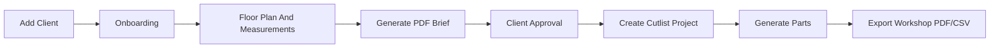

# Spacious Venture App Design Brief

Date: 2026-06-02

## Design Intent

Build Spacious Venture as a premium operational dashboard for an interior studio. The app should feel like a command center, not a brochure site: dark interface, gold accent states, dense project information, clear readiness checks, and direct actions for brief and production handoff.

The app's end goal is the supplied Spacious Venture reference dashboard, adapted to the client's real requirement:

- Client onboarding.
- PDF design brief.
- Cutlist project workflow.
- Material and production standards.

AI image generation, broad design galleries, and experience-centre style moodboards can stay as optional future modules, but they should not distract from the brief and cutlist workflow.

## Experience Principles

1. Start from `Add Client`.
2. Keep every screen operational and useful.
3. Show readiness clearly before export.
4. Use floor plans and room requirements as the source of truth.
5. Turn client answers into a structured PDF brief.
6. Turn approved scope into a cutlist project.
7. Keep all deliverables reusable, exportable, and easy to hand over.

## Primary Screens

### Command Center

Purpose:

Give the studio owner/admin a single place to see every client and delivery status.

Required content:

- KPI row: total projects, active onboarding, briefs ready, cutlists pending, completed exports.
- Project CRM table.
- Brief readiness checklist.
- Cutlist readiness checklist.
- Recent activity.
- Design/production queue.
- Quick actions: Add Client, Generate PDF Brief, Create Cutlist.

### Projects

Purpose:

Track every client/project in a structured CRM table.

Required columns:

- Client / project.
- City.
- Budget band.
- Rooms/modules.
- Floor plan status.
- PDF brief status.
- Cutlist status.
- Next action.
- Readiness score.

### Onboarding

Purpose:

Guide the designer through the client interview from scratch.

Required stages:

- Client profile.
- Project scope.
- Rooms and modules.
- Floor plan and measurements.
- Material and finish preferences.
- Site and vastu checks.
- Production notes.
- Review and generate.

### PDF Briefs

Purpose:

Create, preview, revise, and export the client-facing design brief.

Required sections:

- Cover page.
- Client/project summary.
- Floor plan preview.
- Room scope.
- Module schedule.
- Material assumptions.
- Site constraints.
- Practical checks.
- Approval/sign-off.

### Cutlists

Purpose:

Create a workshop-ready project from the approved brief.

Required sections:

- Module list.
- Material sheet defaults.
- Board thickness defaults.
- Edge banding rules.
- Hardware notes.
- Part list.
- Sheet layout placeholder for V1.
- Export PDF/CSV actions.

### Materials

Purpose:

Maintain practical production material standards.

Required sections:

- Plywood/board.
- Laminates.
- Acrylic/PU/veneer notes.
- Edge banding.
- Hardware.
- Vendor/source notes.
- Maintenance and selection guidance.

## Visual Direction

Use the dark/gold reference as the product target:

- Black sidebar.
- Compact topbar.
- Gold primary button.
- Dense table rows.
- Small thumbnail previews.
- Readiness progress rings/bars.
- Right-side inspector panels.
- Cards with 8px radius.
- No oversized marketing hero.

## Deliverable Flow

## V1 Scope Boundary

Included:

- Dashboard shell.
- Add Client onboarding.
- Floor plan upload and annotation.
- PDF brief generation.
- Cutlist project planning screen.
- Material library.
- Local SQLite/file storage.
- Backup/export foundation.

Excluded from V1:

- DWG/DXF parsing.
- Exact CAD-grade image rendering.
- CNC nesting guarantee.
- Vendor inventory sync.
- Multi-branch permissions.
- Payment collection.

